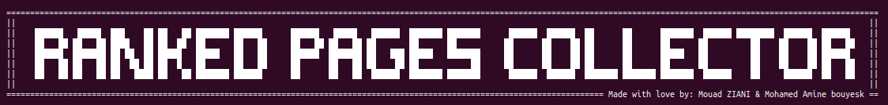

# Ranked pages collector

<p align="center">
  
</p>

Fully configurable automated python script to collect most visted pages based on google dork

## Usage

This project is still under developpement, its documentation is not yet implemented, But if you want to have an idea about how to use it you can check ```main.py``` file


## Security

If you discover any security related issues, please email mouad.ziani1997@gmail.com instead of using the issue tracker.

## Credits

- [Mouad ZIANI](https://github.com/mouadziani)
- [All Contributors](../../contributors)
